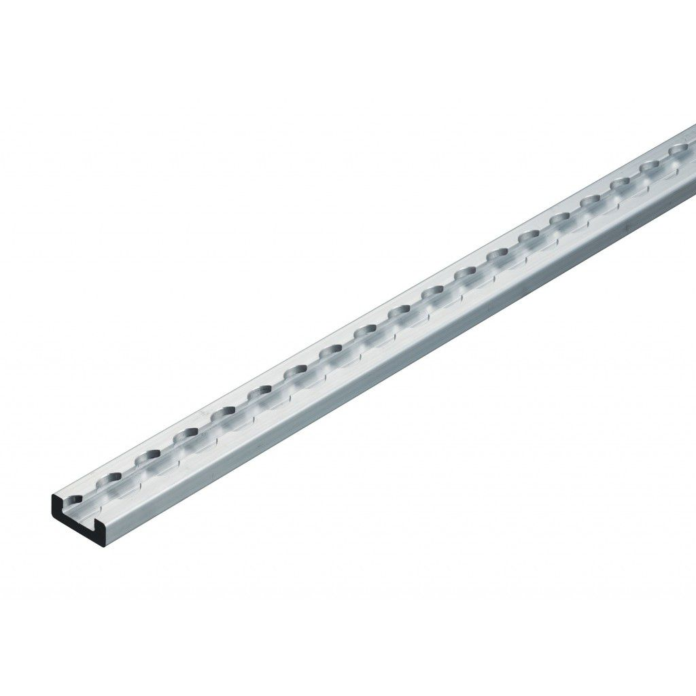
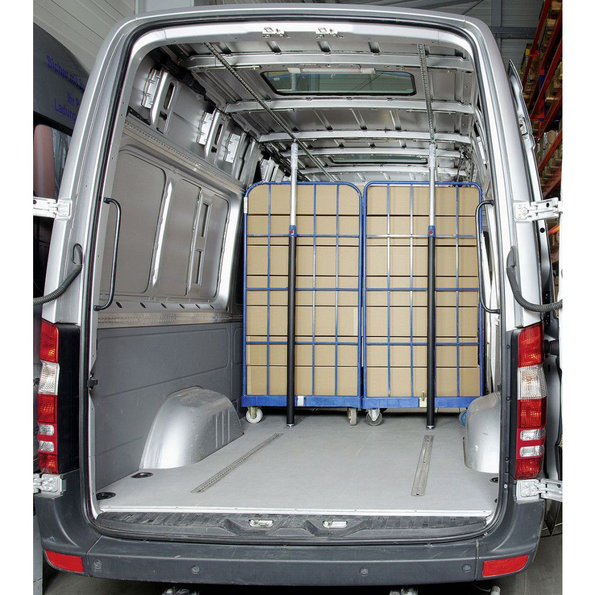
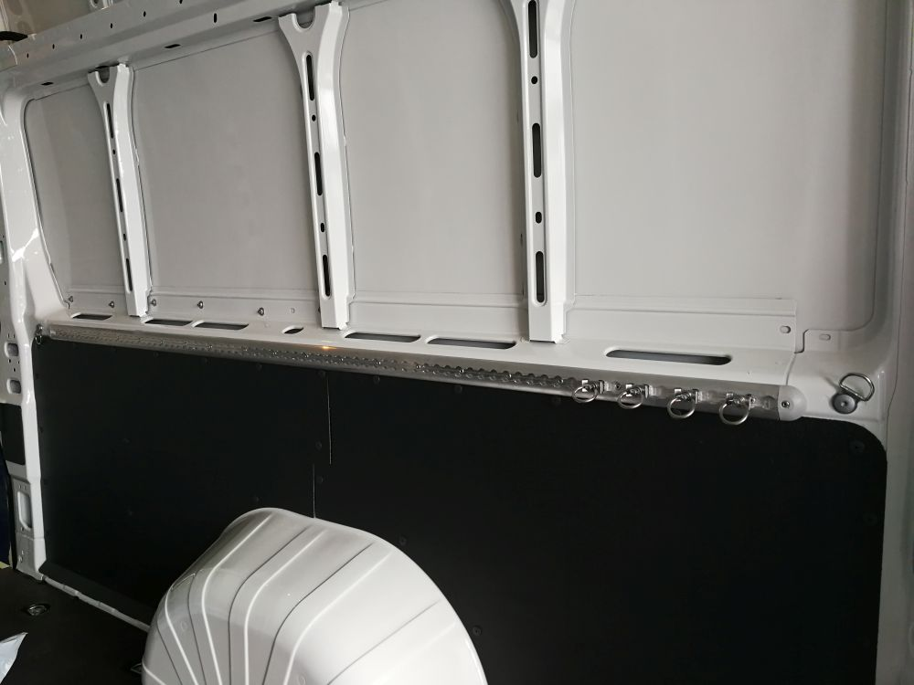
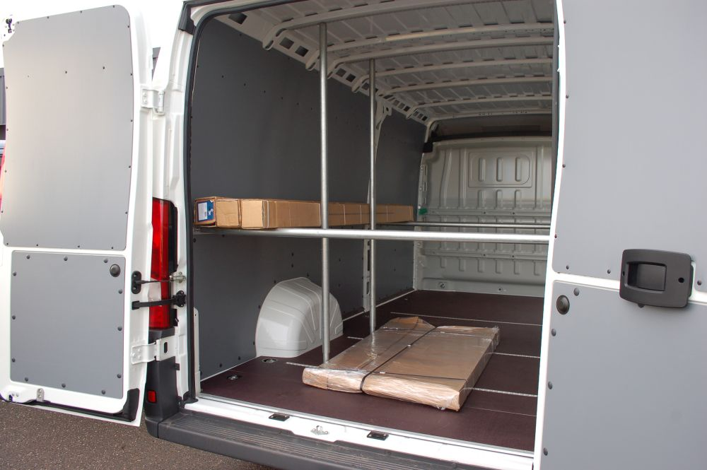
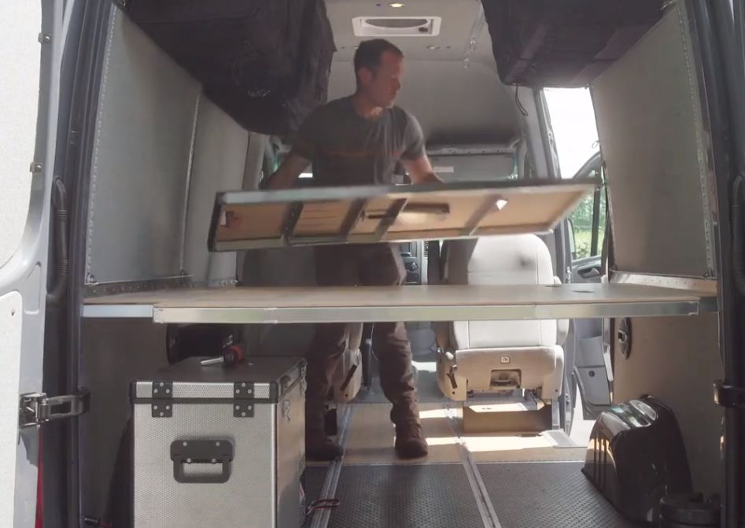
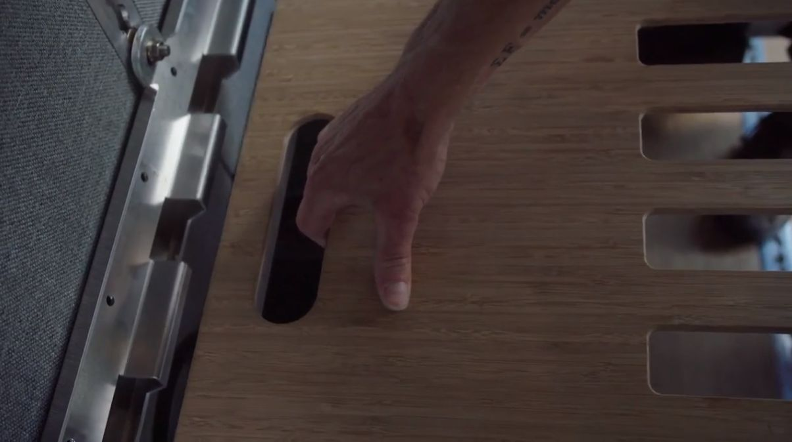
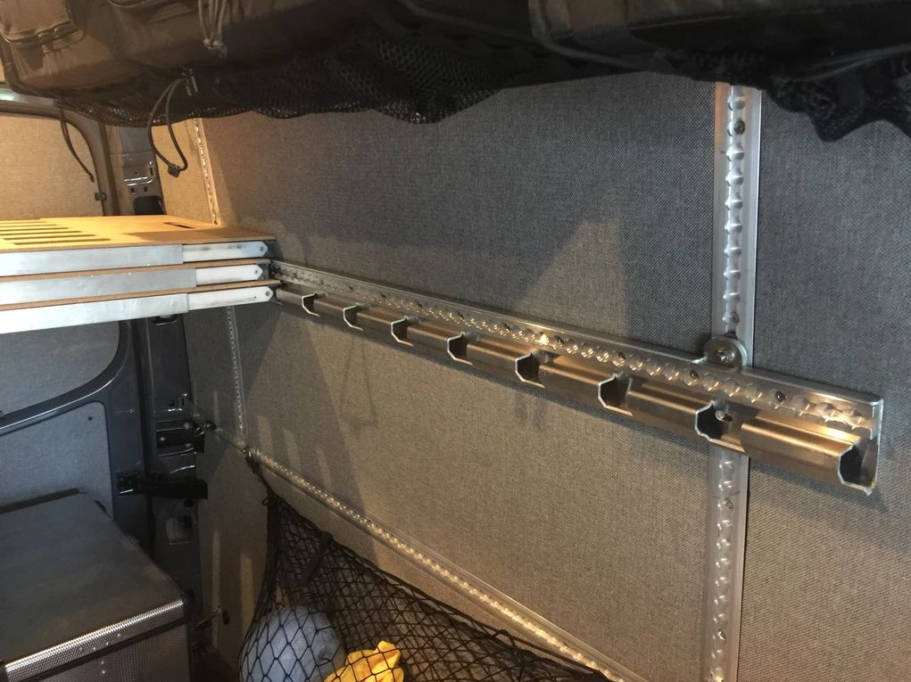
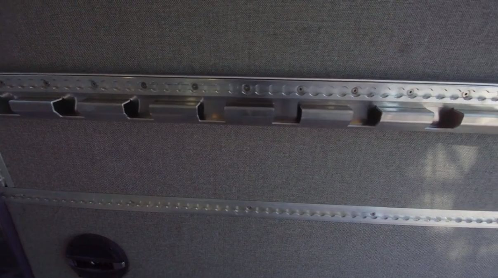

# Zvedací postel

V hlavě jsem měl od začátku systém postelí, který by umožnil maximálně využít
prostor v autě. Chtěl jsem mít dvě patrové postele pro čtyři lidi, u kterých
by se dala měnit výška a zároveň by šly postele libovolně odebírat i skládat. 
V dodávce, kterou jsem koupil byly namontovány upínací lišty a zrodil se nápad
založit celé řešení na průmyslových součástkách pro kotvení. Lišty umožní
i další kotvení v prostoru pod postelema (např. kola).

## Upínací lišty

Jde o systém lišt a různých kotvicích bodů. Tady je pár odkazů:

* [Lišta Airline](https://www.dodavkyeshop.cz/Kotvici-lista-Airline-povrchova-d603.htm)
* [Zápustná lišta](https://www.topcentrum.cz/Zapustna-hlinikova-upinaci-lista-AZV-10-940)
* [Rozpěrná tyč](https://www.dodavkyeshop.cz/Tyc-rozperna-do-Airline-listy-nastavitelna-od-1400-2050-mm-d1080.htm)
* [Dvojitý držák](https://www.dodavkyeshop.cz/Drzak-dvojity-do-airline-listy-pro-Tyc-rozpernou-par-d1065.htm)

Takhle vypadá lišta:

{: style="width:400px"}

Lišty v dodávce:

{: style="width:400px"}
{: style="width:400px"}

Upevnění nákladu:

{: style="width:400px"}
{: style="width:400px"}

## Hotové systémy

Stejný den co jsme se nadchli pro lišty, jsme objevili již hotové systémy
založené na úplně stejné myšlence. S [geniálním řešením přišla firma
Adventure Wagon](https://adventurewagon.com/collections/mercedes-sprinter/products/interior-conversion-kit-for-sprinter)

