# Okna, topení, solární panel

Díky moc Karlovi Ulmanovi, který za mě vyřešil spoustu starostí.

Auto teď vypadá takhle:
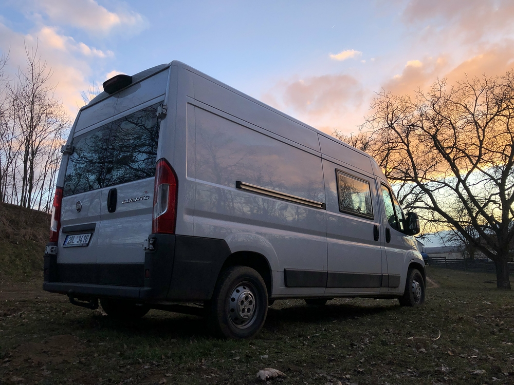

## Okna

Na obou stranách vyklápěcí Dometic 90X55cm
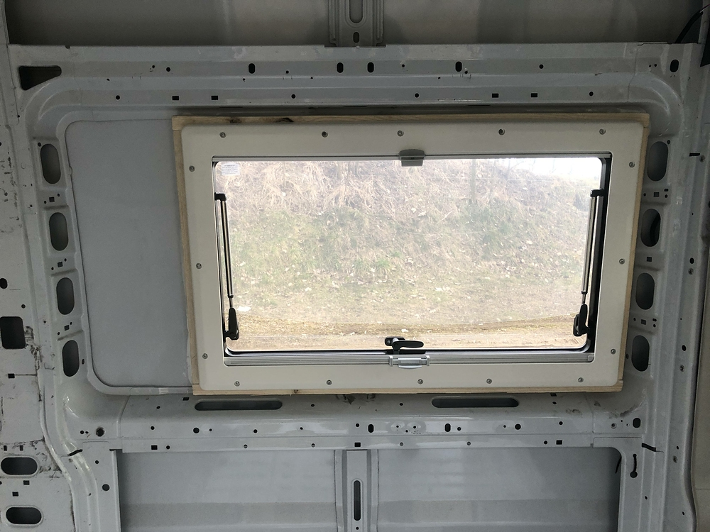

Zatím s nalepenou fólií
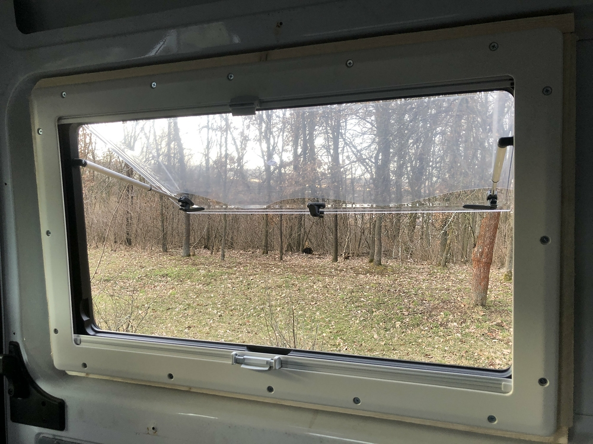

Střešní větrák MaxxFan
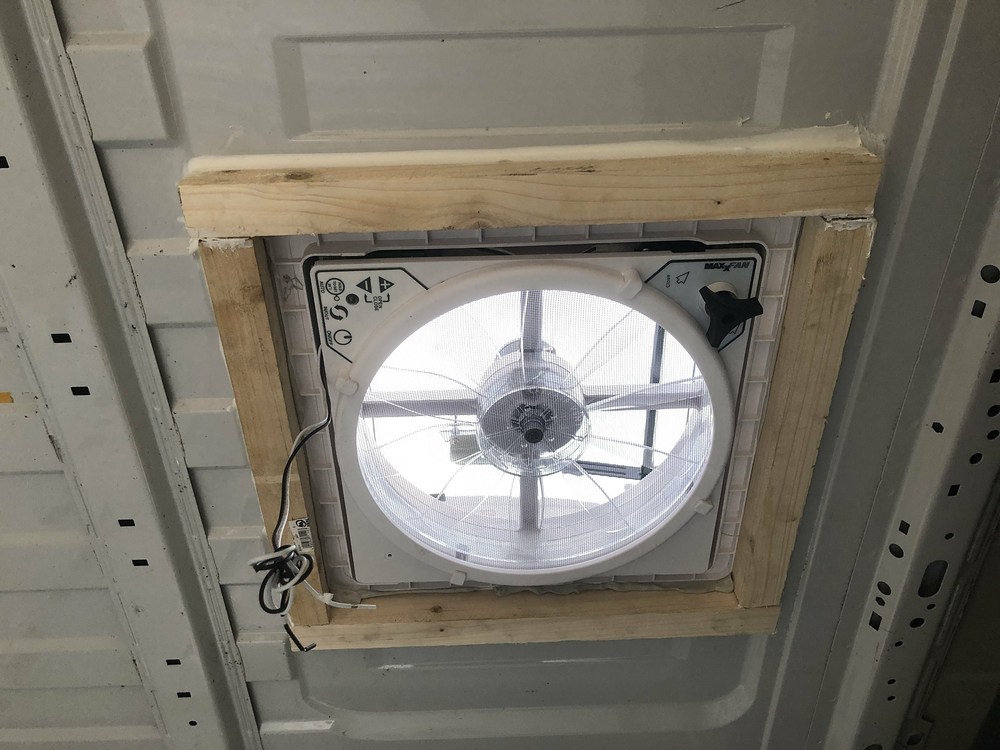

Vzadu nad postelema bude Mini Heki
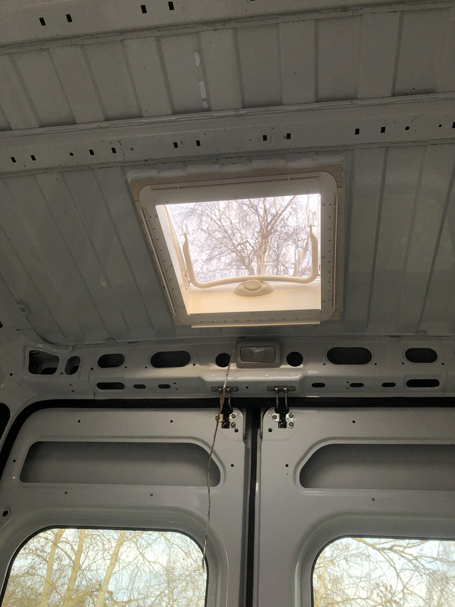

Dřevěný rámeček
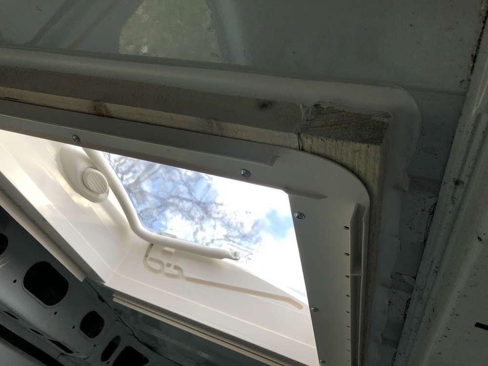

Pěkně se to v autě prosvětlilo
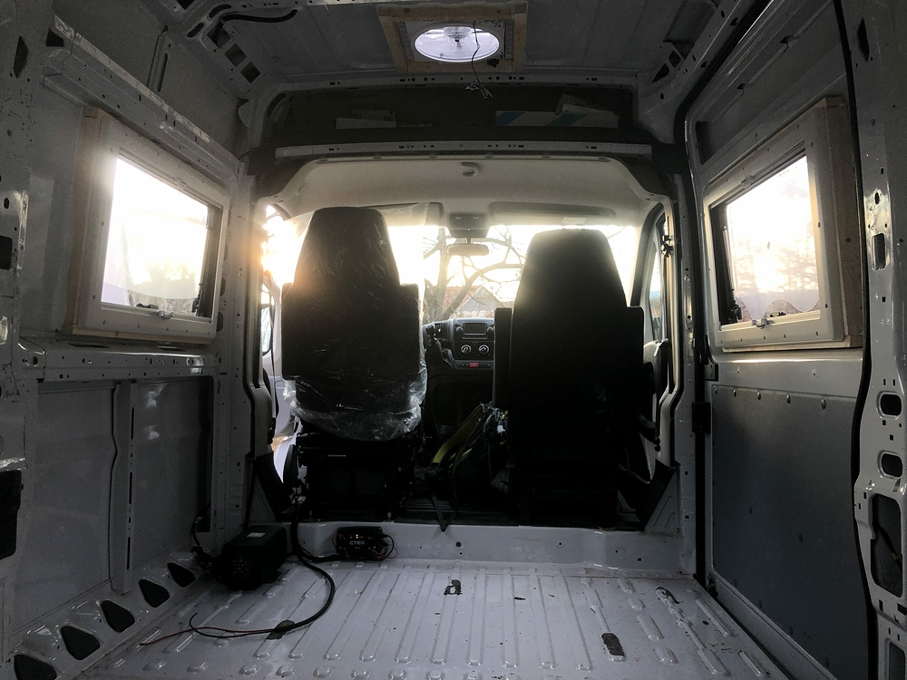

Vyměřujeme místo pro druhou řadu sedadel (Intap)
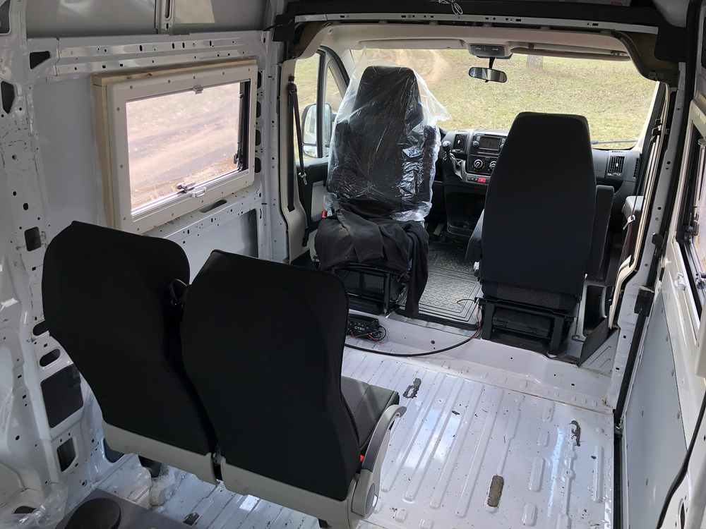

## Topení

Planar 4kW a CTEK, který zvládá několik kombinací dobíjení
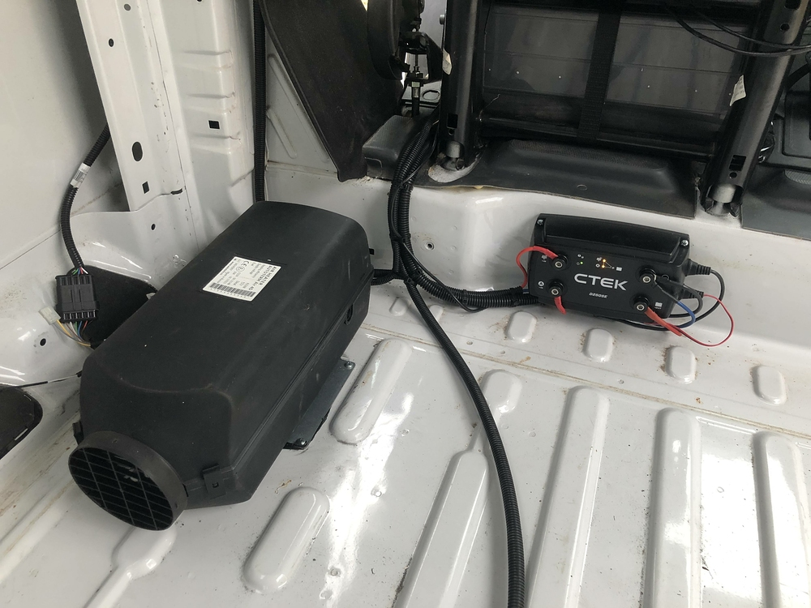

Made in Russia
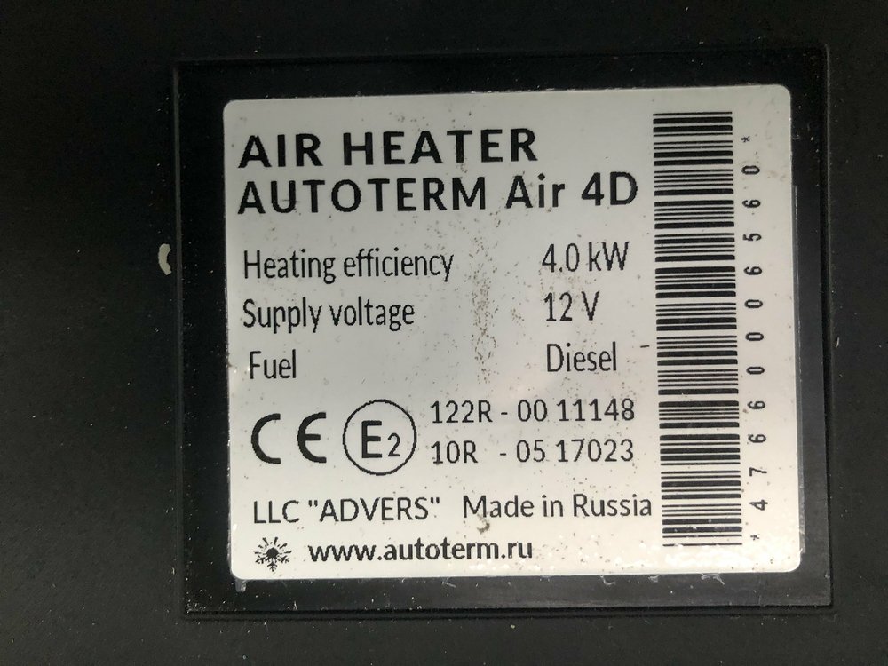

Výfuk a vzadu sání vzduchu, vše pěkně pod autem
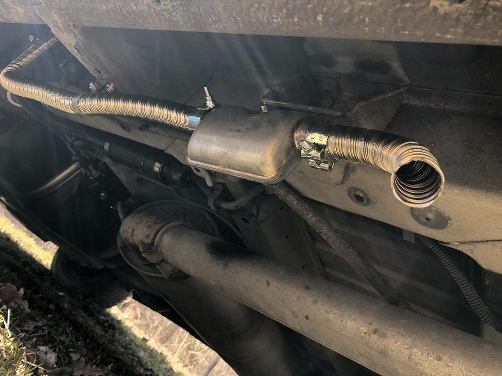

## Solární panel

Jeden panel nalepený přímo na střeše
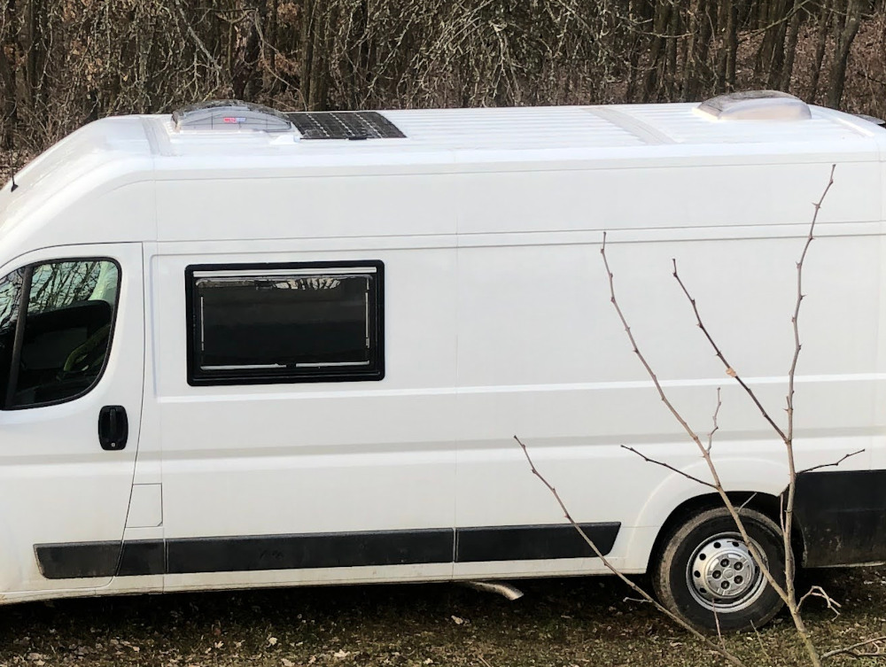

