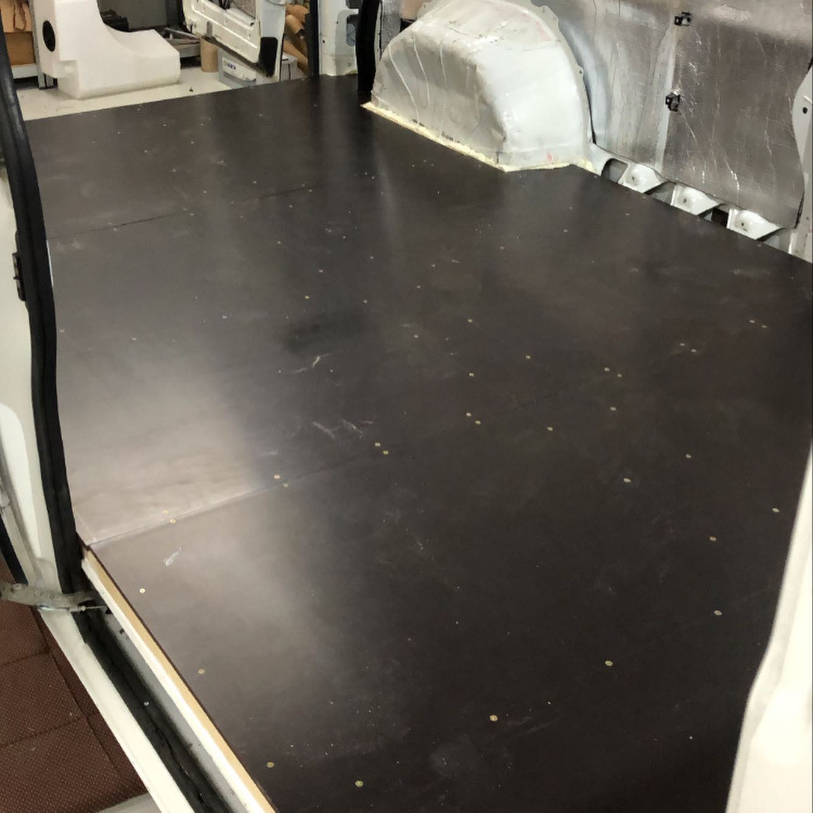

# Ducato podlaha

Hranolky 4x4cm sroubovane a lepene k mezi. Mezi nima 4cm siroka deska styrodur
3000 sc a pred polozenim podlahove desky jeste pokropene nizkoexpanzni penou.
penou je take lehce postrikana podlaha a vypeneny ten styrodur aby se nehnul a
nevrzal. Deska je Foliovana briza 12mm.

12mm protoze mam pod ni rost, tak aby se to neprohybalo.

