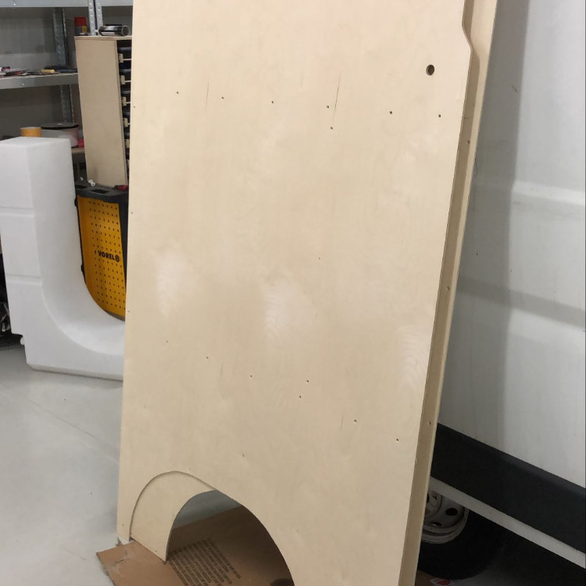
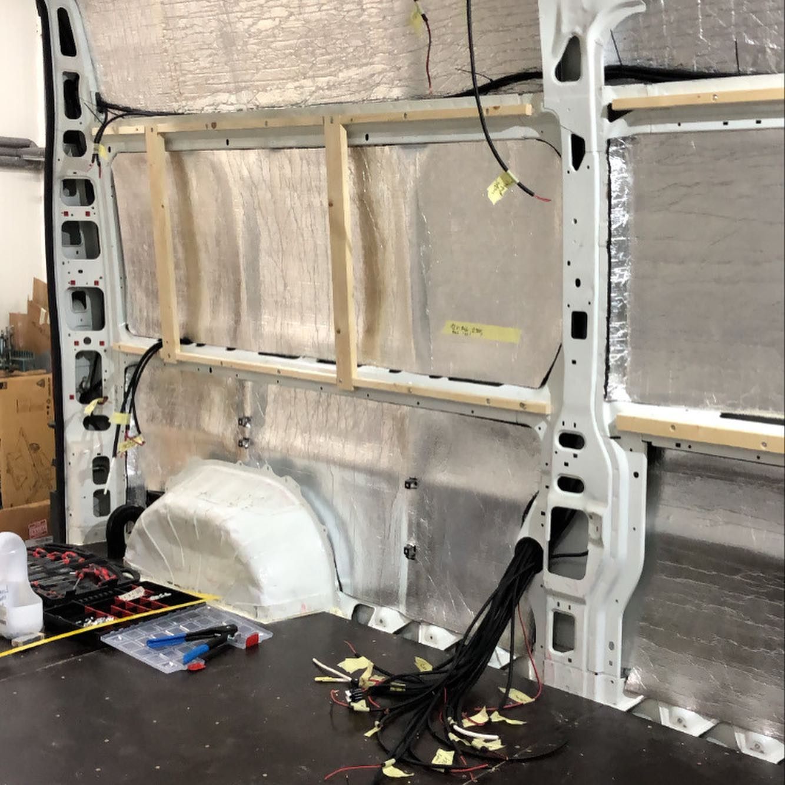
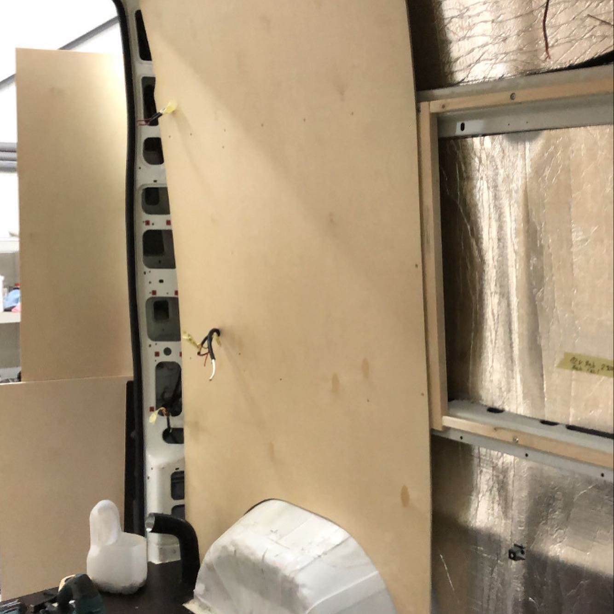
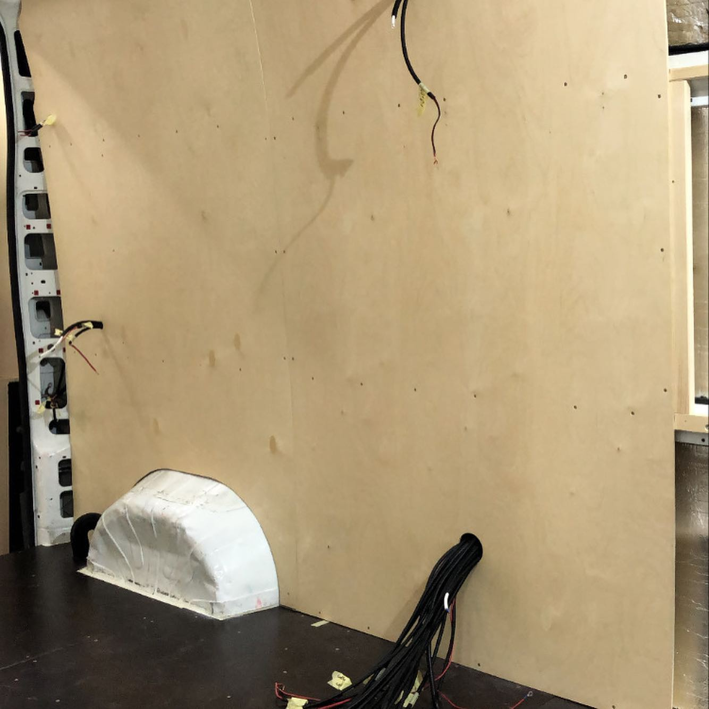
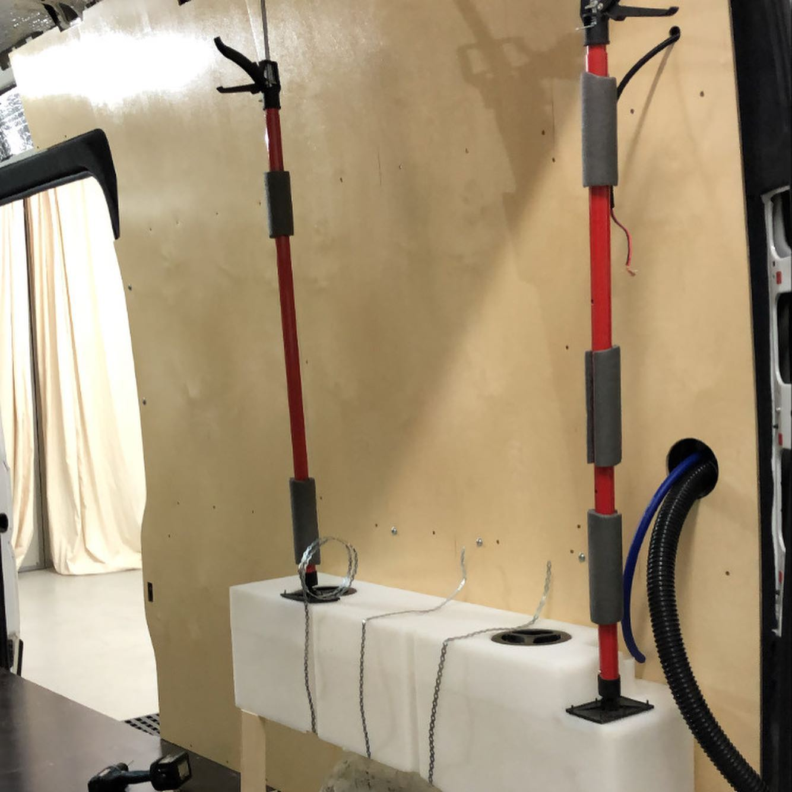
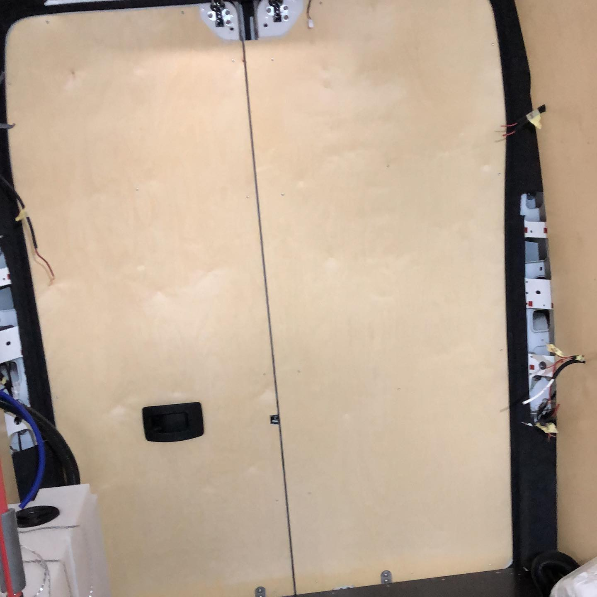
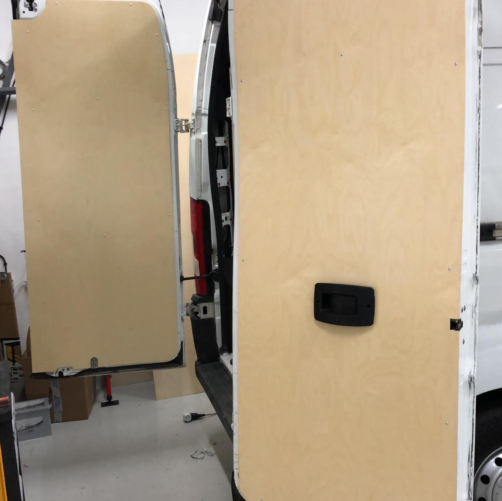
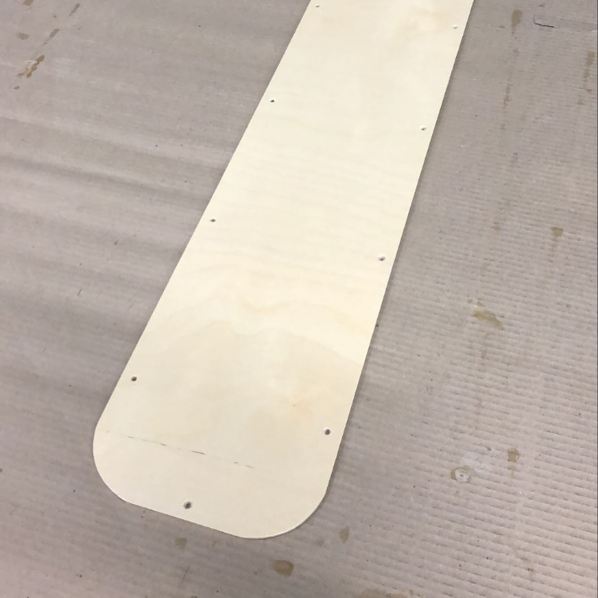
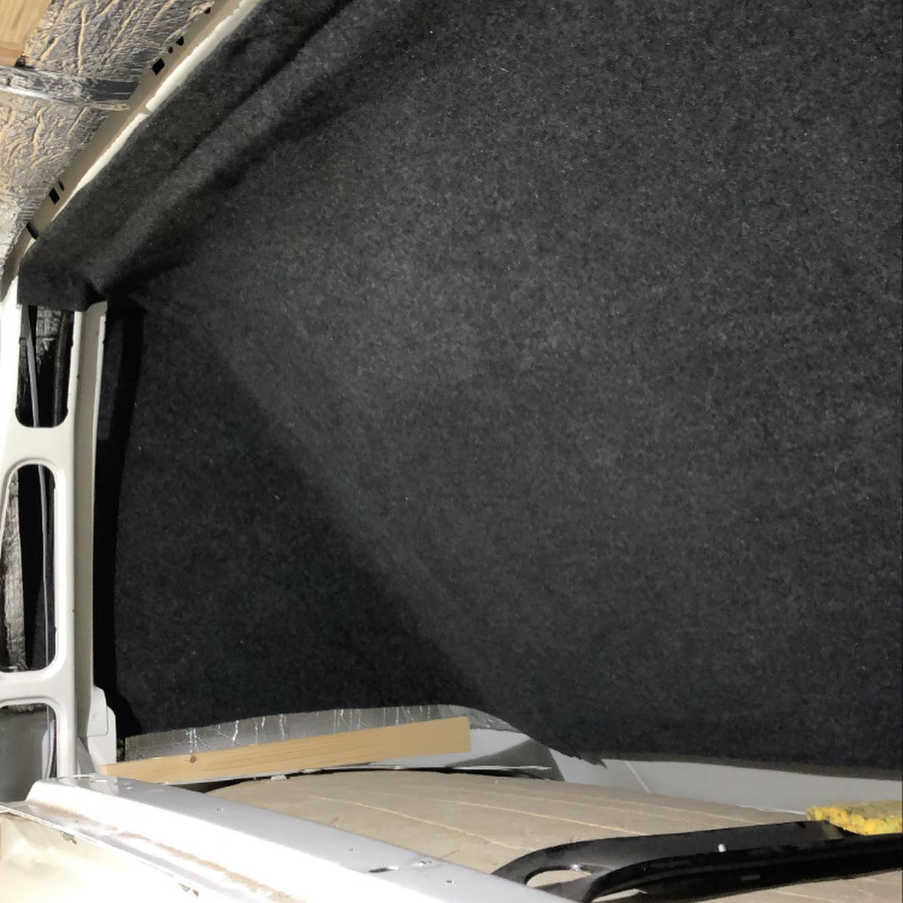
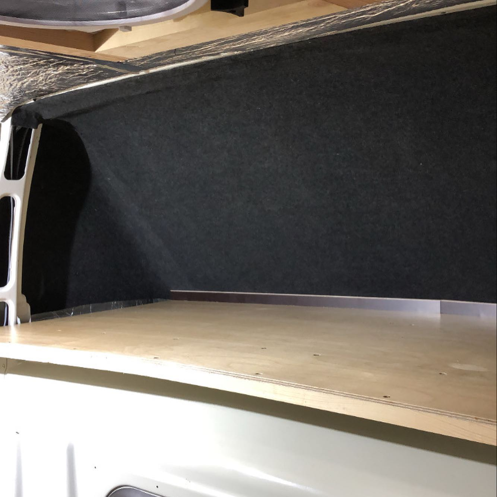

# Ducato - obklady

Bocni steny z 6mm brizy a samozrejme uz klasika u me samolepici koberec na
komplikovame mista. Ulozny prostor nad kabinou jsem zvetsil na maximalni
velikost a udelal bovou podlahu protoze ta bude az k prepazce

